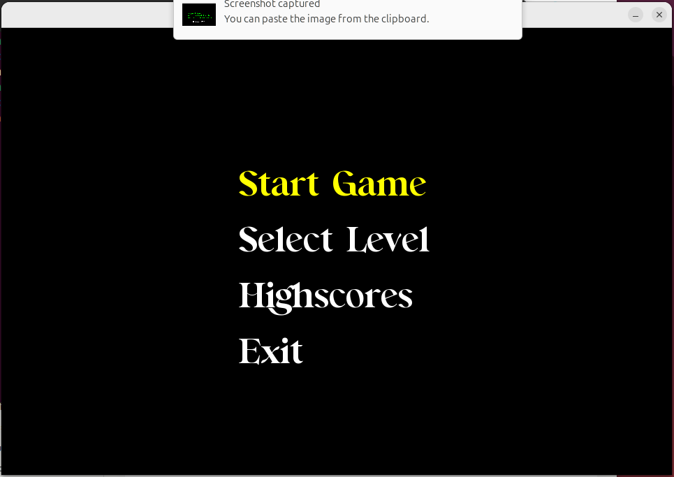
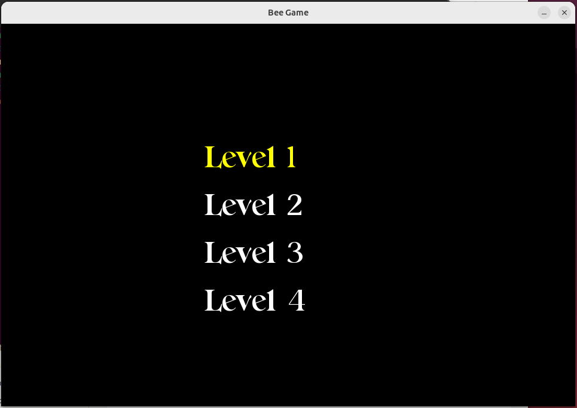
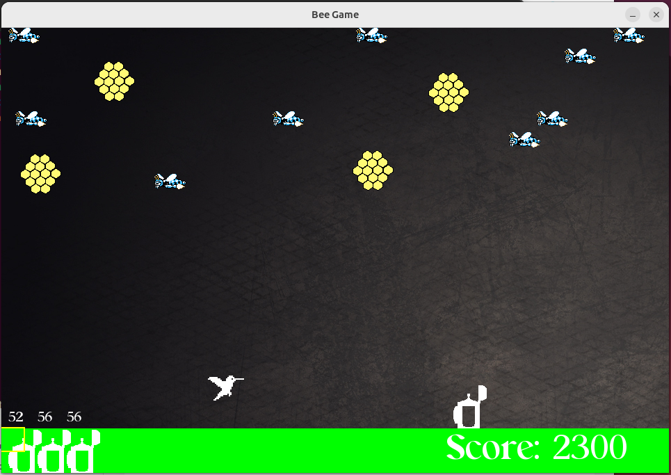
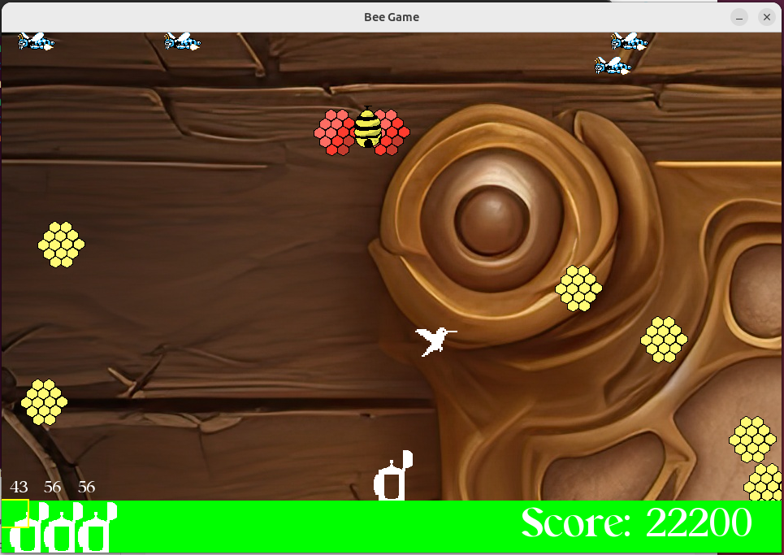
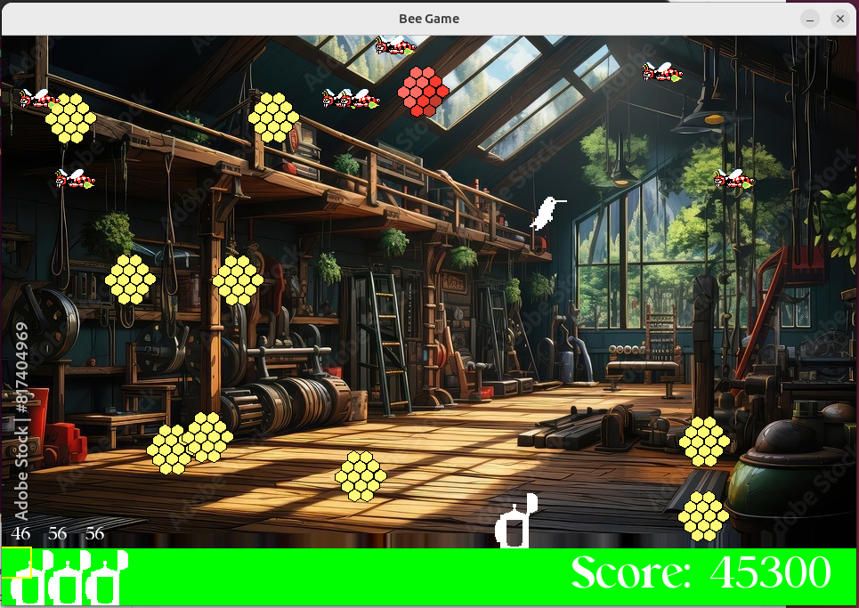
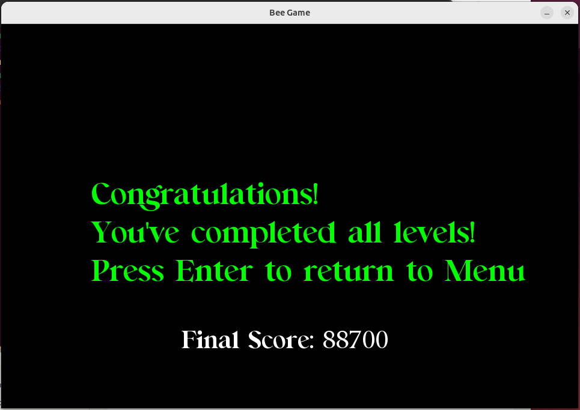

"BuzzBombers Game" - C++ SFML Arcade Shooter
A vibrant arcade-style shooting game built with C++ and SFML where players defend against swarming bees using spray cans. Features multiple levels, dynamic enemy AI, power-ups, scoring system, and visually rich graphics with background music. The game includes boss battles, collectible items, and a high score tracking system.

Key Features:
🎮 Complete Game Engine: Real-time physics, collision detection, enemy AI

🐝 Dynamic Enemies: Regular bees, fast bees, hummingbirds with unique behaviors

🌸 Obstacle System: Flowers restrict player movement, requiring strategy

🍯 Collectibles: Honeycombs and beehives for bonus scoring

📊 High Score System: Persistent score tracking with player names

🎵 Audio-Visual: Background music, sound effects, animated sprites

🎯 Multiple Levels: Progressive difficulty with different enemy types

🕹️ Menu System: Main menu, level selection, pause functionality

Requirements For Compiling (Only need to be run once):

	1) Install GNU G++ Compiler:
	sudo apt-get install g++

	2) Install SFML:
	sudo apt-get install libsfml-dev

Compilation Commands (In Order):
	
	1) g++ -c buzz.cpp
	2) g++ buzz.o -o sfml-app -lsfml-graphics -lsfml-audio -lsfml-window -lsfml-system

Running The Game:
	
	3) ./sfml-app
